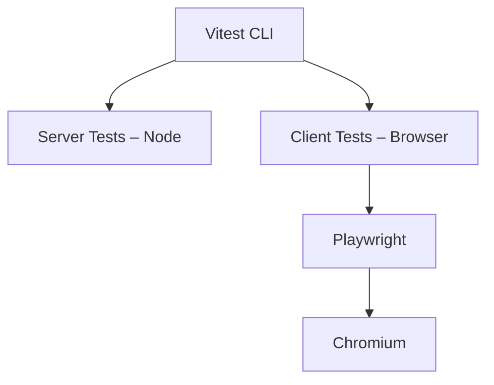

# Team_2 – SvelteKit Project Guide (Updated)

This project is a SvelteKit application configured with Svelte 5, Vite 7, a static adapter with SPA fallback, a base path (/Team_2), TypeScript, Vitest (Node + Playwright), Storybook, and Prettier.

## Requirements

Node.js 20+  
npm (bundled with Node)

## Installation

Run `npm install` to install all required dependencies.

## Development

Run the development server using `npm run dev`.  
To open the browser automatically, use `npm run dev -- --open`.  
Default local address: http://localhost:5173

## File Structure Overview

```text
Team_2/
  src/
    routes/
      +layout.svelte
      +page.svelte
    lib/
      store.ts
    app.d.ts
  static/
    app.html
  svelte.config.js
  vite.config.ts
  vitest-setup-client.ts
  package.json
  README.md
```

## Svelte Configuration Summary

The project uses `@sveltejs/adapter-static` with `fallback: index.html` and `paths.base` set to `/Team_2`.

## Build

Create a production build: `npm run build`  
Built files output to `/build`  
Preview the build locally: `npm run preview`  
Preview URL: http://localhost:4173

## Testing

Vitest is configured with two testing environments: Node and real browser tests via Playwright + Chromium.

Run all tests: `npm run test`  
Run tests in watch mode: `npm run test:unit`  
Install Playwright browsers if needed: `npx playwright install`

Testing architecture:



### Storybook Tests (Project Sub-directory)

Storybook testing is implemented within the **Project** sub-directory.  
This includes:

- Component-level Storybook stories  
- Interaction tests associated with those stories  
- Automated Storybook test execution integrated into the main test suite  

These tests ensure component behavior and UI states remain stable across updates.

To run Storybook-related tests:

```bash
npm run test:storybook
```

## Storybook

Start Storybook: `npm run storybook`  
Storybook address: http://localhost:6006  
Build Storybook: `npm run build-storybook`

## Formatting & Linting

Format code: `npm run format`  
Check formatting: `npm run lint`

## Deployment Notes

Because `paths.base` is set to `/Team_2`, the app must be deployed under that subdirectory.  
If deploying at root, remove or update the base path in `svelte.config.js` and rebuild.

## Quick Commands Reference

Install dependencies: `npm install`  
Start dev server: `npm run dev`  
Build: `npm run build`  
Preview: `npm run preview`  
Run all tests: `npm run test`  
Run watch tests: `npm run test:unit`  
Start Storybook: `npm run storybook`  
Build Storybook: `npm run build-storybook`  
Format: `npm run format`  
Lint: `npm run lint`
